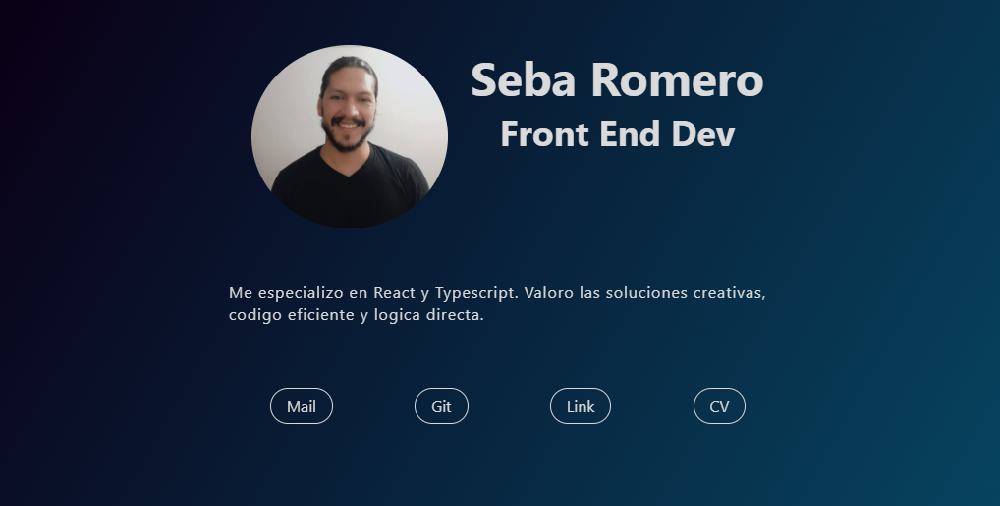
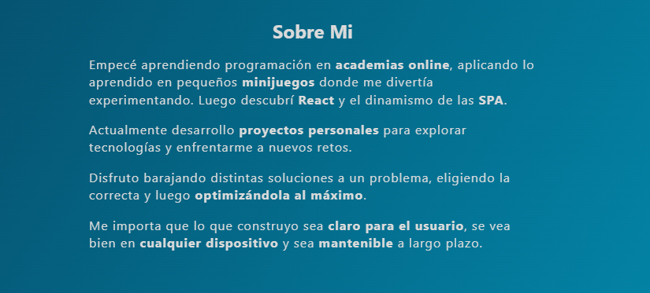
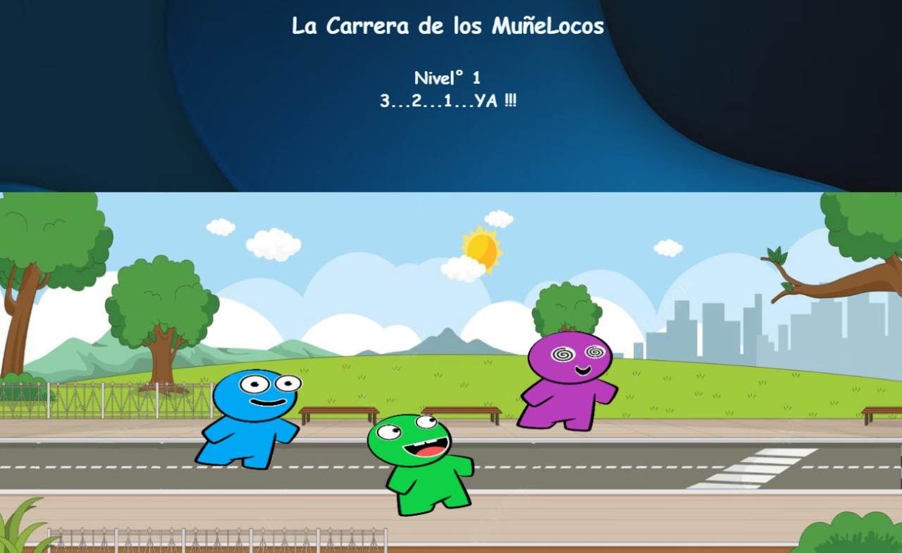
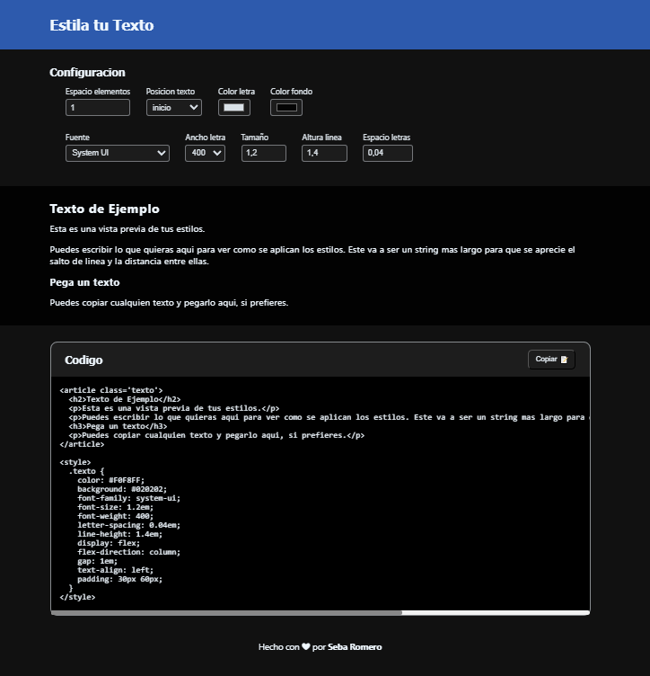
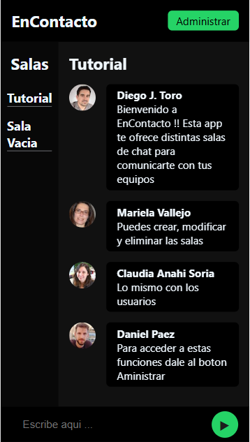

### </> Seba Romero Portafolios

## Front End Developer

## ✨ Características

- Diseño responsive
- Proyectos destacados
- Sección de contacto
- Estructura clara y derecta

## 🛠️ Tecnologías utilizadas

- HTML/CSS  
  Mantener la simpleza lo maximo posible

## 🚀 Demo en vivo

[Portafolios](https://sebaromerox.github.io/portafolios/)

## 📸 Capturas de pantalla

## 🎯 Proyectos destacados

**🏃‍♂️ La Carrera de los Muñelocos**

Juego de velocidad hecho con Vanilla JavaScript.  
Presiona las flechas de direccion lo mas rapido que puedas.  
Llega antes que tus rivales a la meta y pasa al siguiente nivel.

**Tecnologías**

- Vanilla JavaScript
- HTML Canvas
- CSS

[Ir al Sitio](https://sebaromerox.github.io/carrera-munelocos)
[Repositorio](https://github.com/SebaRomeroX/carrera-munelocos)

**🎨 Estila Tu Texto**

Herramienta para estilar, intuitiva y facil de usar.  
Elige los estilos mientras ves los cambios en tiempo real.  
Copialos y pegalos en tu proyecto.

**Tecnologías**

- React
- Context API
- CSS

[Ir al Sitio](https://estilatutexto.netlify.app/)
[Repositorio](https://github.com/SebaRomeroX/estila-tu-texto)

**📱 enContacto**

Gestion de salas de chat.  
Crea distintas salas y a los usuarios que participaran en ellas.  
"Tu equipo siempre enContacto"

**Tecnologías**

- React / TypeScript
- Context API
- React Router
- CSS

[Ir al Sitio](https://encontacto-demo.netlify.app/)
[Repositorio](https://github.com/SebaRomeroX/EnContacto-Demo)

### 📞 Contacto

[LinkedIn](https://www.linkedin.com/in/sebastian-alejandro-romero/)
